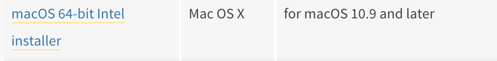
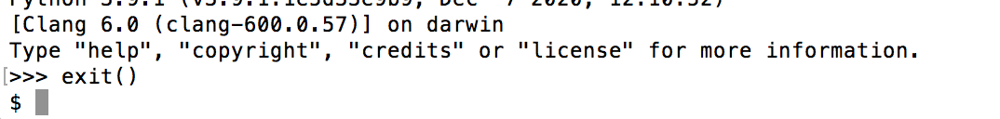

I am using a MacBook Pro on MAC OS X 10.11.6

### Ensure that you have Python3 installed:
+ Download the version of python for your computer.
  - **Your system and installation may be different**
    - If unsure how to proceed, consider using google and searching for ```<my operating system version> python 3 installation instructions```
    - i.e.  ```windows 10 python 3 installation instructions```
    - you should see instructions and videos on the topics to aid you.
  - To download Python3 I went to https://www.python.org/downloads and followed the link for the latest version for my mac.
    - 
    - 
  - I ran the installation file and followed the prompts for my system.
    - Open the folder where you saved the download.
    - Double click the download file
      - 
    - Follow the on screen instructions
      - 
      - 
      - 
      - 
      - 
      - 
    - Close the Install Python window
    - A window should pop up at the end of the installation with the SSL script. Be sure to kick that script off.
      - 
      - 
+ Confirm that you have successfully installed Python on your system.
  - In my case, I will do so via terminal on my mac
    - 
    - 
  - I will first see if Python 3 is on my system
    - I can see that Python3 is installed on my system
      - 
  - I will then try and run Python3
    -     
    - wahoo, eet verks!
  - exit
    - 


+ Install and Verify robotframework

  - Install
    - ```pip3 install robotframework```
      - 
  - Verify
    - ```python3 -m robot --version```
      - 
  - In my situation I want to be able to call robot without python3 in the command.
    - to do this, I'm going to add the following directory to my path variable
      - I will edit my path statement in my user profile
        - ```vi /Users/username/.bash_profile```
        - for the path variable, I'll add the following to the front of the variable
          - ~/.local/bin/:
          - Before Edit:
            - 
          - After Edit:
            - 
  - I can now run the below command to verify robot is working:
    - ```robot --version```
      - 

I now have Python3 and Robot installed.

This is a good break for coffee. 
